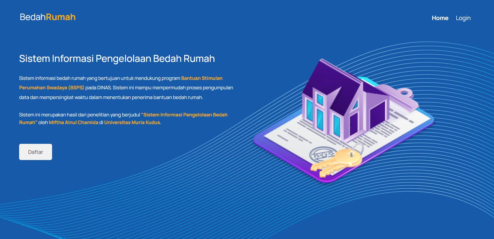

# Bedah Rumah

**Bedah Rumah** adalah aplikasi berbasis web yang digunakan untuk mendata rumah yang akan dibedah. Aplikasi ini dibangun menggunakan framework **CodeIgniter 4**, dengan tujuan mempermudah proses pendataan rumah tidak layak huni dan pengelolaan data terkait perbaikan rumah tersebut.



## Fitur Utama
- **Pendataan Rumah:** Mengelola informasi lengkap tentang rumah yang akan dibedah.
- **Manajemen Pengguna:** Akses terbatas dan pengelolaan hak akses pengguna berdasarkan peran.
- **Laporan dan Statistik:** Menyediakan laporan dan statistik terkait rumah yang sudah dan akan dibedah.
- **Responsif:** Aplikasi ini mendukung tampilan yang responsif sehingga dapat diakses dari berbagai perangkat.

## Persyaratan Sistem
- **PHP 7.4+**
- **Composer** (untuk mengelola dependensi)
- **MySQL** atau **MariaDB** (untuk manajemen database)
- **CodeIgniter 4**

## Instalasi

Ikuti langkah-langkah di bawah ini untuk menginstal dan menjalankan aplikasi **Bedah Rumah** di lingkungan lokal Anda.

1. **Clone repository** ini ke direktori lokal:
    ```bash
    git clone https://github.com/username/bedah-rumah.git
    ```
2. Masuk ke direktori aplikasi:
    ```bash
    cd bedah-rumah
    ```
3. Install dependensi menggunakan **Composer**:
    ```bash
    composer install
    ```
4. Salin file `.env.example` menjadi `.env`:
    ```bash
    cp .env.example .env
    ```
5. Sesuaikan konfigurasi database pada file `.env` sesuai pengaturan database lokal Anda:
    ```bash
    database.default.hostname = localhost
    database.default.database = bedah_rumah
    database.default.username = root
    database.default.password = 
    database.default.DBDriver = MySQLi
    ```
6. Import file `bedahrumah.sql` ke dalam database yang telah Anda siapkan:
    ```bash
    mysql -u root -p bedah_rumah < database/bedahrumah.sql
    ```
7. Jalankan perintah berikut untuk memulai server pengembangan:
    ```bash
    php spark serve
    ```
8. Buka browser dan akses aplikasi melalui `http://localhost:8080`.

## Lisensi

Aplikasi **Bedah Rumah** ini dilisensikan di bawah [MIT License](LICENSE).